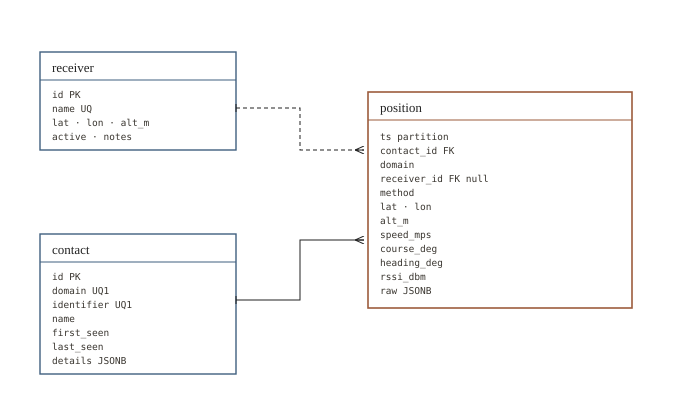

# jsignal-be

Recorder and history API of the **[JSignal](https://github.com/jaggornaut/jsignal)** ecosystem. Subscribes to MQTT, records contacts and their positions in TimescaleDB, serves the history over REST.


Every signal domain shares the same three tables. The domain is the first topic segment (`adsb/...`, `ais/...`): identity and slow-changing attributes belong to a contact, positions are time-series rows, and anything domain-specific stays in a JSONB payload. Supporting a new domain means adding a decoder, not a migration.

Two domains are decoded today: **ADS-B** aircraft and **AIS** vessels.

## Run

```bash
docker compose up -d
```

Starts TimescaleDB and the backend on `http://localhost:8080`. The database is created by the container, the schema by Flyway on first start. The MQTT broker is expected on the host; for a remote one, `MQTT_HOST=<host> docker compose up -d`. Add `--build` to build the image instead of pulling it.

Natively, with Java 21 and a reachable TimescaleDB:

```bash
./mvnw spring-boot:run
```

## Configuration

Defaults are in `src/main/resources/application.yml`. To override, copy `application.example.yml` to `config/application.yml`: Spring reads it on native runs, and the compose file mounts the same directory. Environment variables (`APP_MQTT_HOST`, `SPRING_DATASOURCE_URL`, ...) win over both.

| Property | Default | Purpose |
|----------|---------|---------|
| `spring.datasource.url` | `jdbc:postgresql://localhost:5432/jsignal` | database |
| `app.mqtt.host` / `app.mqtt.port` | `127.0.0.1` / `1883` | broker |
| `app.mqtt.topics` | `adsb/#,ais/#` | subscribed topics, comma-separated |
| `app.positions-max-rows` | `200000` | cap for `/positions`, 413 beyond it |
| `app.retention-days` | unset | daily drop of position chunks older than this |
| `app.receiver-name` | `venezia-1` | receiver this instance attributes positions to |

## Data model



`position` is a TimescaleDB hypertable partitioned by day, compressed after a week. Positions are stored in SI units and converted back to feet and knots by the API. `course_deg` is the direction of travel, `heading_deg` where the vessel actually points — only some protocols report both.

`method` records how a position was obtained: `reported` by the target, `computed` from several receivers, or `predicted` from orbital elements. A position that was not measured by a single receiver has no `receiver_id`.

Flyway owns the schema; Hibernate only validates it.

## API

Timestamps are epoch milliseconds UTC. History endpoints only return points that have a position.

| Endpoint | Purpose |
|----------|---------|
| `GET /health` | liveness and database check |
| `GET /api/v1/domains` | recorded domains with point counts |
| `GET /api/v1/{domain}/range` | first and last timestamp, 204 if empty |
| `GET /api/v1/{domain}/positions?from_ms&to_ms[&track_key][&interval_s]` | positions in a range, optionally one point per track every `interval_s` seconds |
| `GET /api/v1/{domain}/tracks?from_ms&to_ms` | tracks seen in a range, with their domain-specific attributes |

`domains` counts stored positions, not received messages. Messages that carry identity or
attributes without a position — ADS-B velocity-only frames, AIS static reports — update the
contact and are not counted here, so the totals are lower than the message counts reported
before the `receiver`/`contact`/`position` schema.

```bash
curl "http://localhost:8080/api/v1/adsb/positions?from_ms=1718000000000&to_ms=1718003600000&interval_s=10"
```

```json
{"positions": [{"track_key": "4D2228", "label": "AZA123", "lat": 45.5, "lon": 9.5,
                "alt": 36000, "speed_kts": 450.25, "heading_deg": 270.5, "ts_ms": 1718000000000}]}
```

```bash
curl "http://localhost:8080/api/v1/ais/tracks?from_ms=1786035000000&to_ms=1786036000000"
```

```json
{"tracks": [{"track_key": "247214900", "label": null, "points": 5,
             "first_ms": 1786035694269, "last_ms": 1786035784382,
             "attrs": {"mmsi": "247214900", "sog_kts": 0.0, "cog_deg": 323.7,
                       "nav_status": "under way using engine"}}]}
```